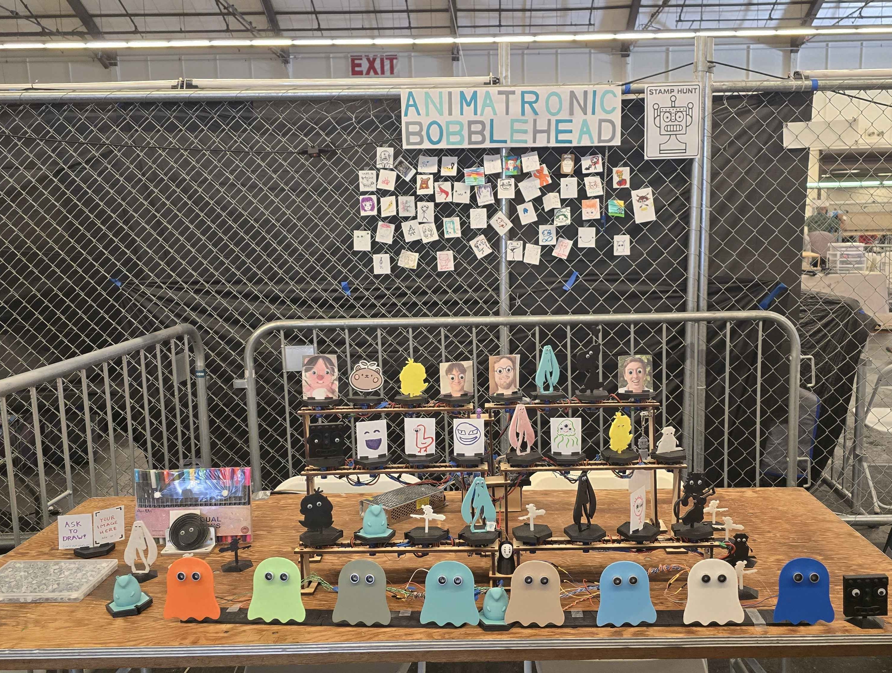
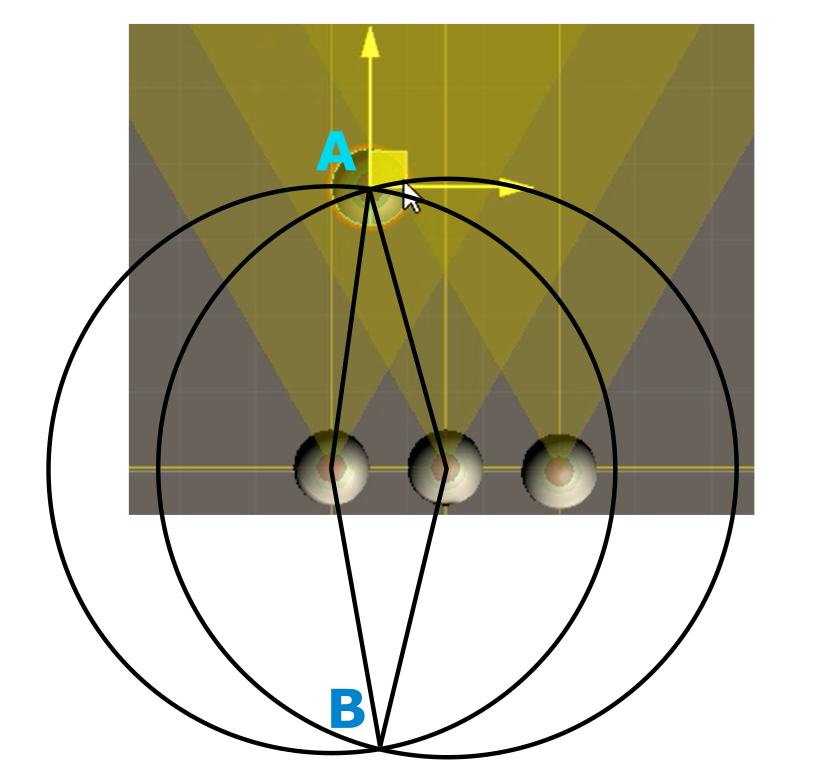
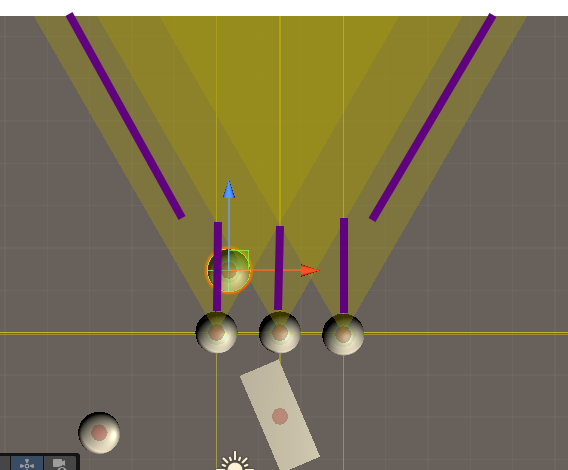

# animatronic-bobblehead



## Overview

Animatronic Bobblehead is a project my friends and I developed to exhibit at Open Sauce 2025. It was an eye-opening (literally) experience of all the wild ideas brought to life from university papers to art and music exhibits to all the unhinged creations giving me an escape from the mundane 9-5.

The goals for this project came down to the following:

1. As close to hardware as feasible (Arduino ok but camera vision not ok)
2. Make the project ~~creepy~~ thematic while preserving some kawaii
3. Ensure attendees are able to interact with the project

The first challenge we faced was figuring out what kind of sensor we could use. Ultrasonic sensors and IR emitters were the first couple options that came to mind. The ultrasonics came out as the winner as a relatively affordable solution we're familiar with. While certainly filled with its own unique challenges (see the "Obstacles" section below), the ultrasonics provided a solution that was "good enough" for our use cases. As an extra bonus, the ultrasonics turned out to be perfect for the ghost eyes we'd end up using for the ultrasonic sensor holders!

For the second goal, the project itself was designed to *be* the theme itself. Cute figures staring at passersby while bobbling about without a care - wouldn't that be so adorable?!? This idea felt more straightforward, we just needed to mount some figures onto servo motors that we can aim at some coordinate..simple enough right? But very quickly we decided we absolutely needed more inherent movement which a spiral spring motor mount brought quite well (as a great fidget toy too!!). Turns out the bobbling portion required significantly more thought than initially anticipated and we needed to add more in the software to make up for the design (see "Additional Features"). And of course, we just had to add some googly eyes to all the figures, they make everything better!!

For the last goal, the inherent design helped achieve this since the lil' figures would follow people walking around or waving their hands in front of the ghosts. Additionally, we made index card holder bases so attendees were able to draw their own creations to stare at attendees throughout the day, possibly the best addition to the project in my opinion :D. By the end, we had collected quite a few art pieces on the fence/wall behind us with quite a few masterpieces!!

## What is happening? (math and other topics)

This can be split into two main phases:

1. Find the desired target
2. Face the figures at the desired target

### Finding the desired target

We chose to stick with an unmoving array of ultrasonic sensors hidden among the display, so we are now working with what is essentially a biangulation?? (triangulation but with only two sources).

A quick lesson on triangulation. I'll use the classic example of the center of the circle being a cell tower and the radius of the circle representing the distance of a cell phone from the cell tower. With one circle (cell tower) and one cell phone, there are an infinite number of places that source could be. With two intersecting circles, there are now two possible places for the cell phone to be - at the two points of intersection. Typically with three (hence the "tri" in triangulation) circles, there could only be a single point where three unique cell towers could intersect, which would identify which of the two points the cell phone is at.

In our case with ultrasonic sensors only providing 15 degree slices of the pie, once the closest object is in the range of two overlapping sensors, we are left with two mathematically possible points and one of these points would be behind the sensors so there is only one valid point. We now know where the target is!

Below is a visualization of the above concept. The two valid points for the target (the sphere) are labeled points "A" and "B". Given point B is not possible, we know the target is at point A and can use those coordinates for latter calculations.



Here is an example of how the edge cases are handled. When the target is too close or on the edge, we try to target a reasonable estimate of where the target is given the limited information.



### Facing the figures at the desired target

With the target coordinates (and heavy math) out of the way, we simply need to calculate the angle each servo motor needs to be with the motor position, target position, and basic trigonometry. The main challenge here was actually determining how we wanted the motors to move. In the end, we decided to go with jerky motions to help induce the bobble and move with "deltas" rather than forcing the motor to try to achieve whichever angle each update loop.

Given the scale of the wiring and set up, especially given we were spread across the state, we were able to use Unity to simulate the logic and design the basic behavior of the sensors and motors. This ended up being super helpful given we were able to visualize

[](https://raw.githubusercontent.com/P2fryang/animatronic-bobblehead/main/media/Top_Down_View.mp4)

## Additional Features

### Smoothing

With the inherent unreliability of running such a system with ultrasonic sensors, it became evident very quickly that we needed some smoothing for the inevitable crazy readings of the ultrasonic sensors. We added a running median from the raw values of the sensors using the "QuickMedianLib.h" library with the number of values controlled by the "NUM_DIST" variable. The main consideration here was how to balance the responsiveness of the system with the consistency of motors.

### Jitter frames

Due to the challenges we faced with insufficient bobble (see obstacles section for more details), we introduced the idea of "jitter frames", where the motors would have additional delays between moving, without adding actual additional delays between calculations etc.

For the sake of this conversation, each "frame" is when the Arduino does a "loop()". Taking the example of JITTER_FRAME = 2, we expect the following behavior:

```C
if (!jitterCounter) {
  moveMotors();
}
jitterCounter = (jitterCounter + 1) % JITTER_FRAMES;
```

- Frame 0: 1 % 2 = 1 != FALSE, don't move motor
- Frame 1: 2 % 2 = 0 == FALSE, move motor
- Frame 2: 1 % 2 = 1 != FALSE, don't move motor
- Frame 3: 2 % 2 = 0 == FALSE, move motor

Thus, we can have larger movement from the motors for more torque inducing rotational movement without needing to reduce the number of readings or pausing the program!

### Random increased deltas

For more fun, of course we need some randomness!! This adds some random number of degrees to the motor movements so there is less uniformity between the motors while sometimes adding significantly more movement with more BOBBBLE! This is relatively straightforward so I'll leave it at that! :]

### X_OFFSET/Y_OFFSET

We ended up not using these, but the original idea was to utilize the Y_OFFSET to make the motors think the subject was closer than they are so we could induce more movement, but this didn't play too well with how the rest of the code was designed. But I think there still is potential with these settings for some fun!

## Obstacles

### Ultrasonic sensors

Among the most frustrating parts of this project were the ultrasonic sensors. Given we looked for the most affordable options of proximity sensors we knew about, this comes as no surprise. These sensors inherently do not perform well against fabric, angled objects, or even other random interference. This typically is not much of an issue until pitted against a project relying on targeting fabric covered people for the use of precise target calculations.

**Issue #1:** Poor reliability

Along with the "smoothing" feature we utilized for more consistent readings, we had discovered the wonderful "NewPing" library that ended up solving quite a few problems by itself. One of which was reliability and understanding when the sensor is not reading anything. Even with the improvements, the unreliable readings were still quite present by the time it came to exhibit.

**Issue #2:** Needing multiple pins (PWM ones specifically)

With a project originally scoped for 8-10 sensors and 24+ servo motors, we were in for quite a headache on a lack of pins available for even the Arduino Mega.

The "NewPing" library actually relieved a ton of pain on this front as it actually not only allows you to merge the "echo" and "trigger" pins, but allows you to run these on the abundant digital pins rather than the scarce PWM pins on the board. This freed us up to run two separate systems each with 4 sensors (limit was not number of pins :]) and 12 servo motors straight from the Arduino! (besides the power of course)

### Bobbling

The original goal was to have both the rotational spiral springs for the motor assembly as well as figures that bobble, but this was always the lowest priority compared to making sure everything else was manufactured. We only ended up with a couple designs with true bobble - a snoopy with a heart on a pen spring, and the Open Sauce robot head printed with some springs. The robot head bobbleheads actually turned out much more enjoyable to fidget with than initially anticipated, we take these wins!

Given we had to rely on the springs which had their own frictions to overcome (literally), we turned to software to exaggerate figure movements to hopefully induce more bobble. This is where the JITTER_FRAMES, large motor deltas (10 degrees base), and random increased deltas came from.

### Tracking behavior

Touched briefly in the ultrasonic sensors section, it was an interesting challenge to determine how the figures should move or handle the target being in range of at least two sensors, only one sensor, or completely out of range.

**Two sensors:** 

Pleasantly, this one was more straightforward, just face the known coordinate.

**Only one sensor:**

This one was more interesting...for the case of the inner sensors, we could just face the motors at a target some distance in front of the sensor. However, this quickly breaks the illusion when dealing with the side sensors. In these cases, we instead traced an angled line for the motors to face instead. Ironic given this is just a line, my single brain cell worked overtime initially to understand how the math fits into what I wanted.

**No sensors:**

Initially, we had the motors snap to center when it didn't see any users, but once set up at the venue, we decided it would feel more pleasant for the figures to remain where they last saw someone and have no reset or idle behaviors.

### Stand

Probably the piece that had the least love and attention, we designed a simple stand where we could screw the motors into the stand at whichever desired location in an organized manner. But given the nature of the project, it was also an interesting topic with the constant vibrations and space constraints to design something that would fulfill the requirements.

The ultrasonic sensor stand designs also saw a couple iterations. We ended up with a stand design that allows the ghosts to float, relying on a clamping pressure to hold the sensors in place. This actually ended up being a very solid addition, surviving a couple falls off the table before we decided to tape the stand down :D.

### Power

With the stall current of the servos running up to 750mA from some sources online, we needed to seriously beef up the power source to avoid at best, having nothing move, and at worst, brick our Arduinos. We did most of our testing using a pre-2000s AT computer power supply that had a 5V line with enough power. The next challenge here was running this power to all the consumers, combating soldering solid and stranded wires of different gauges (what I had on hand).

### Wiring

We ended up with a monstrosity that looked more like a creature's rib cage than anything. Given we needed the wires to span the table, we went with CAT5e bundles of wires for the data lines (and power for the sensors), 18 gauge stranded wires to carry the power to the motors, and terminated with a mix of 22 AWG solid core and Arduino jumper cables. This monstrosity ended up with 54 T-joints of stranded and solid core and a total of 96 terminations (+ another 38 going to the Arduino and PSU). While not the most intricate or even complex, it was certainly a *joy* working with these bundles of mixed core wires with some rusty soldering skills (~2 years since regular soldering).

## Potential Improvements

The main improvements I'd love for this project live around the figure designs and theming. While I can spend endless hours refining the tracking and movement, I'm reasonably satisfied with what I ended up with there.

Starting off on the figures, I just wish we had more time to design more proper bobble heads. You bet these will show up in a future project. We also had a number of duplicate designs, it would be great for future similar projects to have increased variety and other fun designs!

Next with the sensor holders, there is so much potential for red lighting and cottonball clouds or other decorative additions.

Onto the stands, while functional and not the focus of the project, I feel like there is still so much polish decorating and theming the stands could add to the ambience and ~~creepiness~~ theme.

And of course, I can't forget all the decorations around the table as well. We left off with some disassembled spring/motor assemblies, and some figures mounted on individual stands for people to interact with. It was very enjoyable seeing repeat visitors pass by to "gently" tap on the Sauce bot bobblehead...ah, all the lost potential in true bobbleheads...next time...

But with that, I'll leave off saying that I had a blast working on this project with my friends and bringing my own bout of unhinged energy to Open Sauce 2025 and I absolutely hope to be there again in the next and following years!!
